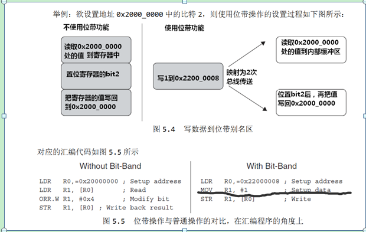
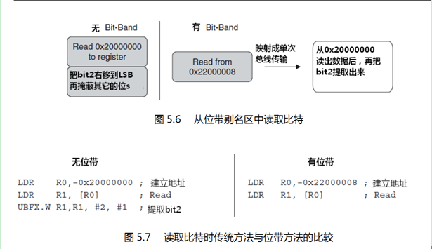
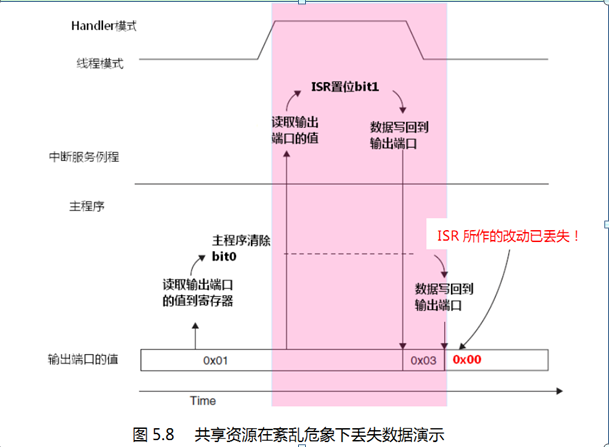
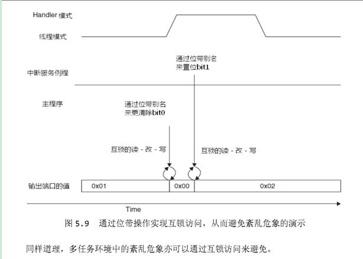

#Cortex-M3 Bit-Banding
##1. 概述
CM3的存储器系统支持所谓的“位带”（bit-band）操作。  
通过它，实现了对单一bit的原子操作。位带操作仅适用于一些特殊的存储器区域中。
 

从汇编角度看：
  
与传统方法的比较：
  
在位带区中，每个比特都映射到别名地址区的一个字——这是个只有 LSB才有效的字。
 
支持位带操作的两个内存区的范围是：  
__0x2000_0000-0x200F_FFFF（SRAM区中的最低 1MB）  
0x4000_0000-0x400F_FFFF（片上外设区中的最低1MB）__
##2. 优点
+ 位带操作对于硬件 I/O密集型的底层程序最有用处了;
+ 位带操作还能用来化简跳转的判断。
	+ 当跳转依据是某个位时，以前必须这样做：
    	+ 读取整个寄存器
		+ 掩蔽不需要的位
		+ 比较并跳转
	+ 现在只需:
		+ 从位带别名区读取状态位
		+ 比较并跳转
+ 位带操作还有一个重要的好处是在多任务中，用于实现共享资源在任务间的“互锁”访问;
	+ 多任务的共享资源必须满足一次只有一个任务访问它——亦即所谓的“原子操作”。
	+ 以前的读－改－写需要 3 条指令，导致这中间留有两个能被中断的空当。
	于是可能会出现如下图所示的紊乱危象：
  
同样的紊乱危象可以出现在多任务的执行环境中.其实，上图所演示的情况可以看作是多任务的一个特例：
_主程序是一个任务，ISR是另一个任务，这两个任务并发执行。_  
通过使用 CM3的位带操作，就可以消灭上例中的紊乱危象。CM3把这个 **“读－改－写”** 做成一个硬件级别支持的原子操作，不能被中断，如下图：
   

##3. 其它数据长度上的位带操作
位带操作并不只限于以字为单位的传送。亦可以按半字和字节为单位传送。例如，可以使用**LDRB/STRB**来以字节为长度单位去访问位带别名区，同理可用 **LDRH/STRH**。但是不管用哪一个对子，都必须保证目标地址对齐到字的边界上。  
##4. 在 C语言中使用位带操作
```
//把“位带地址+位序号”转换成别名地址的宏
#define BITBAND(addr, bitnum) ((addr & 0xF0000000) + 0x20000000 + ((addr & 0xFFFFF) << 5) + (bit<<2));

//把该地址转换成一个指针
#define MEM_ADDR(addr) *((volatile unsigned long *) (adr));
 ```
在此基础上，我们就可以如下改写代码：
```
MEM_ADDR(DEVICE REG0) = 0xAB; //使用正常地址访问寄存器，即把0xAB作为DEVICE REG0地址上的值
MEM_ADDR(DEVICE_REG0) = MEM_ADDR(DEVICE_REG0) | 0x2; //传统做法
MEM_ADDR(BITBAND(DEVICE_REG0， 1)) = 0x1； //使用位带别名地址
```
**请注意:** 当使用位带功能时，要访问的变量必须用 volatile来定义。因为 C编译器并不知道同一个比特可以有两个地址。所以就要通过 volatile，使得编译器每次都如实地把新数值写入存储器，而不再会出于优化的考虑，在中途使用寄存器来操作数据的副本，直到最后才把副本写回——这会导致按不同的方式访问同一个位会得到不一致的结果（可能被优化到不同的寄存器来保存中间结果——译注）