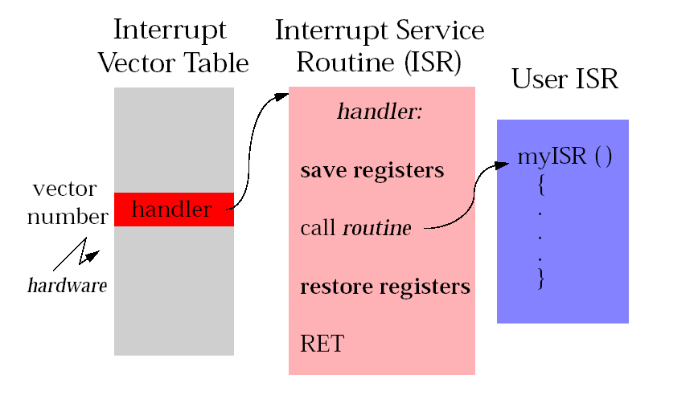

 
#1. BSP概述
BSP即Board Support Package，板级支持包。  
它来源于嵌入式操作系统与硬件无关的设计思想，操作系统被设计为运行在虚拟的硬件平台上。  
对于具体的硬件平台，与硬件相关的代码都被封装在BSP中，由BSP向上提供虚拟的硬件平台，BSP与操作系统通过定义好的接口进行交互。  
BSP是所有与硬件相关的代码体的集合。  

一个成熟的商用操作系统，其被广泛应用的必要条件之一就是能够支持众多的硬件平台，并实现应用程序的硬件无关性。  

一般来说，这种无关性都是由操作系统实现的。  
但是对于嵌入式系统来说，它没有像PC机那样具有广泛使用的各种工业标准、统一的硬件结构。  
各种嵌入式系统各不同的应用需求就决定了它一般都选用各自定制的硬件环境，每种嵌入式系统从核心的处理器到外部芯片在硬件结构上都有很大的不同。  
这种诸多变化的硬件环境就决定了无法完全由操作系统来实现上层软件与底层硬件之间的无关性。  

因此各种商用实时操作系统，都采用**分层设计** 的方法，将系统中与硬件直接相关的一层软件独立出来，称之为Board Support Package，简称为BSP。  
顾名思义，BSP是针对某个特定的单板而设计的。如果没有单板支持软件包，则操作系统就不能在单板上运行。  
并且它对于用户（指开发者）也是开放的，用户可以根据不同的硬件需求对其作改动或二次开发。  
**BSP在嵌入式系统中的角色，很相似于在PC系统中的BIOS和驱动程序的地位**。  

BSP的具体结构和组成根据不同的嵌入式操作系统而不同。BSP的开发要求设计人员**具备软硬件方面的综合知识**。  

BSP软件与其他软件的最大区别在于 **BSP软件有一整套模板和格式，开发人员必须严格遵守，不允许任意发挥**。  
在BSP软件中，绝大部分文件的文件名和所要完成的功能都是固定的。 所以，BSP软件的开发一般来说都是在一个基本成型的BSP软件上进行修改，以适应不同单板的需求.  
针对某类CPU的硬件单板，嵌入式操作系统(如vxWorks)通常提供有其DEMO板的BSP, 这些程序位于指定的目录之下。也就是我们所说的最小系统BSP。  
一般来说，我们在硬件系统设计好之后，都会先找到一个与自己系统相近 的DEMO板BSP（最起码是使用相同的CPU）。并以此为基础,开发自己单板的BSP。  

#2. BSP定义
为软件操作系统正常运行提供最基本、最原始的硬件操作的软件模块，它和操作系统息息相关，但又不属于操作系统的一部分。BSP可以分为三大部分：

	1：系统上电时的硬件初始化。
	2：为操作系统访问硬件驱动程序提供支持。
	3：集成硬件相关和硬件无关的操作系统所需的软件模块。
  
BSP向上层提供的接口有：
	
	与操作系统内核的接口（如报告DRAM大小、修改中断屏蔽级别等）
	与操作系统的I/O系统的接口
	与应用程序的接口

广义上讲，单板中所有需要CPU控制的硬件的程序，都属于单板BSP，但是，为了调试方便和软件的模块化，**通常就将与单板最小系统相关的程序简称为BSP，而将其他程序称为驱动程序**。
对于嵌入式系统来说，所谓最小系统就是一个包含：CPU、 Bootrom、RAM、系统时钟、网口、串口的计算机运行环境。
这样，最小系统BSP就包含了CPU系统的初始化程序以及网口、串口、系统时钟等设备的驱动程序。

#4. BSP的主要功能
BSP的主要功能在于配置系统硬件使其工作于正常的状态，完成硬件与软件之间的数据交互，为OS及上层应用程序提供一个与硬件无关的软件平台。因此从执行角度来说，其可以分为两大部分：  

	1. 目标板启动时的硬件初始化及多任务环境的初始化
	2. 目标板上控制各个硬件设备正常运行的设备驱动程序，由它来完成硬件与软件之间的信息交互

通常我们认为BSP是为OS服务的， 但实际上， BSP软件包中的部分程序对OS也并不是必须的，从这个角度，又可以将BSP划分为两部分：

    1. 最小系统BSP，即我们通常所称的BSP
    2. 设备驱动程序

#5. BSP实际开发的主要过程
5.1.	掌握开发中使用的操作系统，和在这种操作系统下开发BSP的要求。
5.2.	研读所选CPU的资料。
5.3.	研读硬件设计文挡。
5.4.	研读电路板中器件的资料。
5.5.	找一个BSP模板，熟悉它并在此基础上开发自己的BSP(从头研制BSP工作量极大，也没有必要)
5.6.	利用仿真器进行调试，开发最小BSP系统。
5.7.	在最小BSP的基础上，利用Tornado集成开发环境，进一步调试外围设备，配置、完善系统。
5.8.	调试单板上的设备驱动程序。

#6. BSP的调试方法
#####最小系统的调试和设备驱动程序的调试
6.1仿真器调试方式
6.2 “黑”调
6.3 使用集成开发环境
6.4 中断处理

特点： 保证处理的实时性、减少CPU的消耗  
中断的处理流程： 中断处理程序首先切换到中断堆栈，保存程序计数器和寄存器等中断现场状态，然后对中断进行处理，中断处理过程中必须要及时清除中断源，最后要恢复中断前的程序计数器和寄存器等现场状态，由中断处理程序返回。
  

中断的限制
1. ISR要尽量的短，能在任务中完成的工作就不要放在ISR中。
2. ISR不能调用将会导致阻塞的子程序。
3. ISR不能take 信号量，但是ISR可以give信号量。
4. 由于子程序malloc（）、free（）使用了信号量，ISR不能调用它们。
5. ISR不能通过VxWorks的驱动执行I/O。
6. ISR不能调用使用了浮点协处理器的子程序。

#7. 单板的硬件组成
BSP与单板密切相关，要开发BSP就要了解单板的硬件组成，单板一般由CPU最小系统和一些外围硬件设备构成.  

CPU最小系统：  
CPU、内存、内存控制器、调试串口、调试网口、系统时钟、桥片、外围芯片（包括）、实时时钟、定时器、FPGA、部分嵌入式系统也包括软硬盘控制器、显卡、键盘。  

不同单板使用不同的专用设备芯片：  
DMA控制器、E1传输芯片、光接口芯片、时隙交换、FLASH、host/pci桥片 pci/pci桥片、以太网口芯片（如intel的82559、realtek的8139）、以太网口交换芯片（BCM5616）、CSM5000、CSM5500、看门狗、专用FPGA逻辑等等。  
