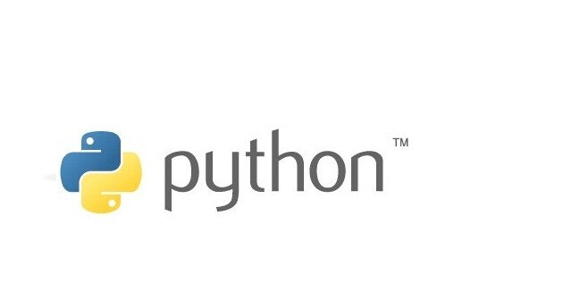
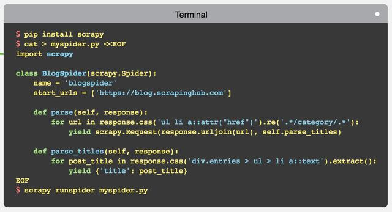

  
#python学习笔记  
#1.关于#!/usr/bin/env python
这只是告诉操作系统这个脚本的解释、执行程序的具体位置，加了这个头，在"X"类操作系统中就直接可以这样执行脚本了“hello.py”,否则的话就得这样执行“python hello.py”.
区别：  

```python 
#!/usr/bin/python   #直接告诉计算机执行程序的具体位置  
#!/usr/bin/env python #告诉计算机执行程序在系统环境变量中的名字，详细位置在环境变量中设置好了  
```

这些都是非必要的，因为在执行脚本时，可以用详细路径来标明：
```python
/usr/bin/python hello.py  
```

在windows中也可以这样，不过一般设置了环境变量后可以直接“hello.py”.
#2.格式化输出
指定占位符宽度：  
```python
print ("Name:%-10s Age:%08d Height:%8.2f"%("Aviad",25,1.83))  
```
科学计数法  
```python
format(0.0015,'.2e')   
```
#3.关于#-*- coding:utf-8 -*-
用来程序指定编码格式
#4.关于缩进4个空格
对于函数，循环，判断都需要正确的缩进
#5.关于注释
单行使用#开头  
多行使用'''或者"""  
#6.异常处理和捕获
try...except:   
```python
try：  
	file("hello.txt", "r")#如果文件不存在，引发异常  
	print "读文件"  
except IOError:  #捕获IO异常  
	print "文件不存在"  
except： #其它异常  
	print "程序异常"  
```
try...finally:    
```python
try:   
	f = open("hello.txt", "r")  
	try:  
		print f.read(5)  
	except:  
		print "读文件异常"  
	finally:  
		print "释放资源"  
		f.close()  
except IOError:
	print "文件不存在"  
```
使用raise抛出异常:
```python
try:
	s = None
	if s is None:
		print "s 是空对象"
		raise NameError #如果引发NameError异常，后面的代码将不能执行
	print len(s)
except TypeError:
	print "空对象没有长度"
```
自定义异常：  
assert断言语句:  

#7.基本数据类型

> |整形| int| 1,2|   
> |----|---|----|  
> |浮点| float| 1.20|   
> |布尔| bool| b == True|      
> |字符串| str| 'str'或者"str"|    
> |列表| list| [1,2,4,5]|    
> |元组| tuple| ('d', 300)|    
> |字典| dirt| {'name':'coco','country':'china'}|    
#8.正则表达式基础
##1. 概括
正则表达式并不是Python的一部分。正则表达式是用于处理字符串的强大工具，拥有自己独特的语法以及一个独立的处理引擎，效率上可能不如str自带的方法，但功能十分强大。得益于这一点，在提供了正则表达式的语言里，正则表达式的语法都是一样的，区别只在于不同的编程语言实现支持的语法数量不同；但不用担心，不被支持的语法通常是不常用的部分。如果已经在其他语言里使用过正则表达式，只需要简单看一看就可以上手了。  
下图展示了使用正则表达式进行匹配的流程： 
    
正则表达式的大致匹配过程是：依次拿出表达式和文本中的字符比较，如果每一个字符都能匹配，则匹配成功；一旦有匹配不成功的字符则匹配失败。如果表达式中有量词或边界，这个过程会稍微有一些不同，但也是很好理解的.  
下图列出了Python支持的正则表达式元字符和语法:  
  
详细参考[http://www.cnblogs.com/huxi/archive/2010/07/04/1771073.html](http://www.cnblogs.com/huxi/archive/2010/07/04/1771073.html "正则表达式基础")  


#9.pygame
开发游戏软件很不错的库
#10.scrapy
scrapy 是一个 python 下面功能丰富、使用快捷方便的爬虫框架。用 scrapy 可以快速的开发一个简单的爬虫.  
  
快速入门可以参考《Scrapy 从这里开始：Hello Scrapy》.  
###scrapy安装
安装步骤:[http://www.cnblogs.com/txw1958/archive/2012/07/12/scrapy_installation_introduce.html](http://www.cnblogs.com/txw1958/archive/2012/07/12/scrapy_installation_introduce.html "scrapy安装教程")  
入门教程:[http://www.cnblogs.com/txw1958/archive/2012/07/16/scrapy-tutorial.html](http://www.cnblogs.com/txw1958/archive/2012/07/16/scrapy-tutorial.html "scrapy入门教程")  
####注:scrapy当前还不支持python3.x 因此可以安装Python2.7.6.  
2016/7/4 16:56:06 

#11. 学习python的网站
[http://www.zhihu.com/question/20702054](http://www.zhihu.com/question/20702054 "知乎")  
[http://geek.csdn.net/forum/68](http://geek.csdn.net/forum/68 "Python开发者")  
[http://www.runoob.com/](http://www.runoob.com/ "菜鸟教程")  
[http://www.iplaypython.com/](http://www.iplaypython.com/ "玩蛇网")  
[http://www.kuqin.com/abyteofpython_cn/](http://www.kuqin.com/abyteofpython_cn/ "简明 Python 教程")  
[http://www.kuqin.com/docs/diveintopythonzh-cn-5.4b/html/toc/](http://www.kuqin.com/docs/diveintopythonzh-cn-5.4b/html/toc/ "dive into python")  

#12. python实战
[https://my.oschina.net/zhangdapeng89/blog/53910?p=1]
[http://www.cnblogs.com/isuifeng/p/5839748.html]

