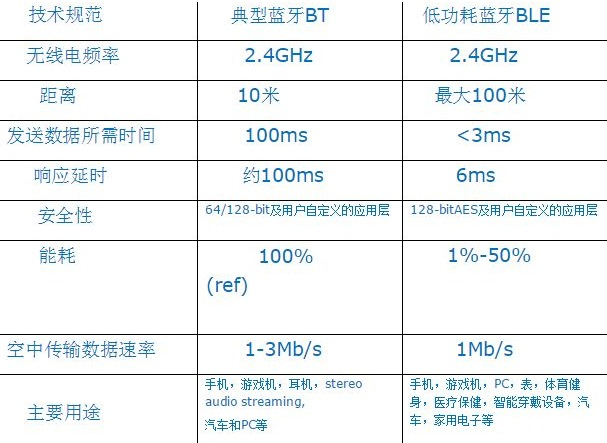

###1.BLUETOOTH基本了解
1. BLUETOOTH出自丹麦  
2. Bluetooth SIG 蓝牙技术联盟,非盈利组织.主要任务是发布蓝牙规格、管理资格认证程序、保护蓝牙商标及宣传蓝牙无线技术.
3. 重要网站
	1. 蓝牙SIG的官网: [www.bluetooth.org](http://www.bluetooth.org "蓝牙SIG的官网")
	2. 蓝牙技术应用网站: [http://www.bluetooth.com](http://www.bluetooth.com "蓝牙技术网站")
4. 蓝牙技术规范	 
	1. 使用2.4GHz频段（2.402~2.480GHz),带宽为1Mb/s,以时分
方式进行全双工通信，其基带协议是电路交换和分组交换的组合.
	2. 使用跳频技术减少同频干扰，79个频点/Mhz，跳频速度1600次/秒  
	3. 发射功率为1mW，发射距离一般为10m，最大可以达到100m（一些认证对发射功率有要求，不能太高）
	4. 蓝牙技术支持1 个异步数据通道或3 个并发的同步话音通道，
或1 个同时传送异步数据和同步话音的通道。每一个话音通道支持64kb/s 的同步话音；异步通道支持最大速率为721kb/s，反向应答速率为57. 6 kb/s的非对称连接，或者是432. 6 kb/s 对称连接。
	5. 依据发射输出电平功率不同，蓝牙传输有3 种距离等级Class1为100m左右；Class2 约为10m；Class3 约为2-3m。

5. 蓝牙技术的特点:
	1. 采用跳频技术，数据包短，抗信号衰减能力强；
	2. 采用快速跳频和前向纠错方案以保证链路稳定，减少同频干扰和远距离传输时的随机噪声影响;
	3. 使用2.4GHzISM 频段，无须申请许可证；
	4. 可同时支持数据、音频、视频信号；
	5. 采用FM 调制方式，降低设备的复杂性。
6. 
6. 蓝牙版本
	1. 最新4.1版本为Bluetooth Low Energy(BLE)超低功耗,可用于可穿戴设备.
###2.BOOTH核心协议了解
  
按照各层协议在整个蓝牙协议体系中所处的位置，蓝牙协议可分为底层协议、中间层协议和高层协议三大类。    
	1. 蓝牙底层协议实现蓝牙信息数据流的传输链路,是蓝牙协议体系的基础,它包括射频协议(RFP)、基带协议(Baseband)和链路管理协议(LMP)。  
	2. 蓝牙中间层协议完成数据帧的分解与重组、服务质量控制、组提取等功能,为上层应用提供服务,并提供与底层协议的接口,此部分包括主机控制器接口协议(HCI)、逻辑链路控制与适配协议(L2CAP)、串口仿真协议(RFCOMM)、电话控制协议(TCS)和服务发现协议(SDP)。  
	3. 蓝牙高层协议包括对象交换协议(OBEX)、无线应用协议(WAP)和音频协议(audio)。 

蓝牙相关协议:  
	1. 蓝牙核心协议：Baseband，LMP，L2CAP，SDP  
	2. 电缆代替协议：RFCOMM  
	3. 电话传送控制协议：TCS二进制，AT命令集  
	4. 应用协议：PPP、UDP/TCP/IP、OBEX、WAP、vCard、vCal、WAE  
	5. 传统蓝牙与BLE对比分析见下表:  
  
6. 蓝牙组网方式
	
   

	
1. **微微网（piconet)：  **
		点对点（图a）或点对多点（图b），由一个主设备和最多255个设备组成，其中最多可以有7个从设备处于active模式
2. **散射网（scatternet)：**
		由多个微微网组成(图c)，一个微微网的主设备可以成为另一个微微网的从设备
7. 蓝牙设备地址（BD_ADDR）：
	蓝牙的收、发信机都分配有一个 48 位的蓝牙设备地址 (BD_ADDR)，该地址取自IEEE802标准.
8. 

###3.蓝牙模块
  
1. 蓝牙模块主要分三个层次：蓝牙协议栈，蓝牙管理模块及Profile适配层，蓝牙应用。  
2. 蓝牙应用分蓝牙前台，蓝牙引擎，中间件和解码模块。  
3. 蓝牙协议栈将蓝牙的复杂和细节屏蔽起来，通过蓝牙管理模块及Profile适配层，蓝牙应用几乎不用关心蓝牙的技术实现细节，只需要关心应用逻辑本身。
4. 蓝牙管理模块可以看作是一个抽象层，包含了许多与蓝牙直接相关的技术实现细节。
5. 蓝牙引擎涉及的蓝牙部分，都是通过蓝牙管理模块及profile适配层来完成的。蓝牙引擎以“应用功能状态”的变化为驱动事件来自动运行，向蓝牙前台提供一个更容易理解的播放器概念。另外，蓝牙引擎可以直接访问和部分控制数据链路。  
蓝牙前台涉及的蓝牙交互部分，都是通过蓝牙管理模块及profile适配层来完成的。现在蓝牙前台以“设备连接状态”的变化为驱动事件来相应蓝牙连接。

#####蓝牙协议栈的功能
1. 蓝牙设备自管理功能，即能响应手机的任何蓝牙操作，默认过滤掉数据链路，它也会通过发送异步事件到蓝牙子模块的方式请求上层服务。  
2. 支持蓝牙推歌和蓝牙打电话应用模式，建立并管理对应的数据链路，并向上层提供部分控制数据链路的方法。
3. 提供多种手机与蓝牙音响的交互手段，包括AVRCP控制，HFP控制，SPP/BLE手机遥控，SPP/BLE蓝牙控制模组，HID手机输入设备等。
4. 向上层提供实时查询蓝牙协议栈状态的方法。
5. 向上层提供蓝牙连接和设备管理的方法。

