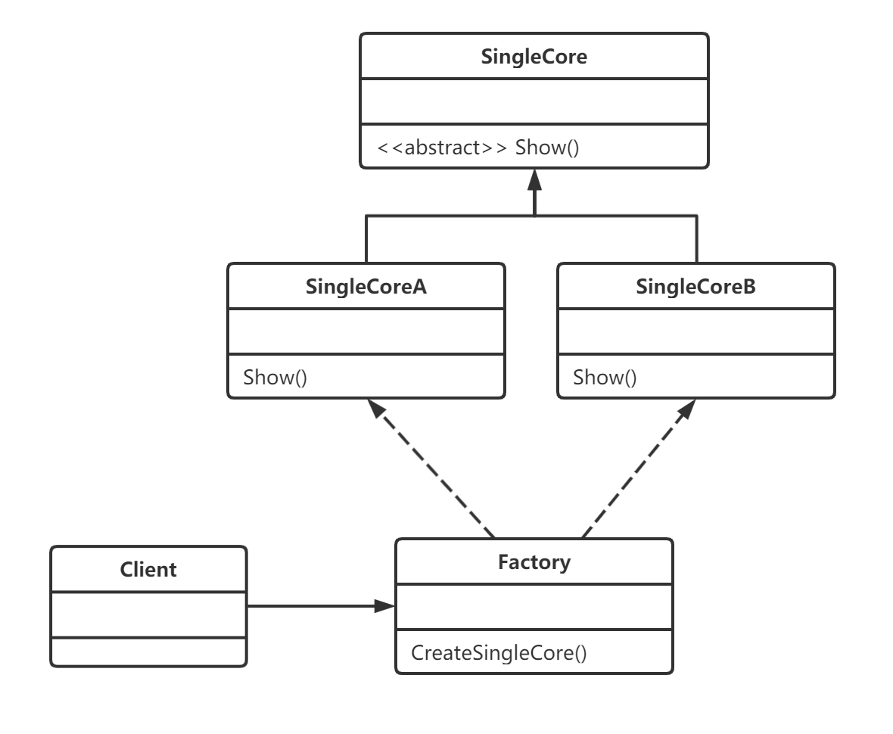
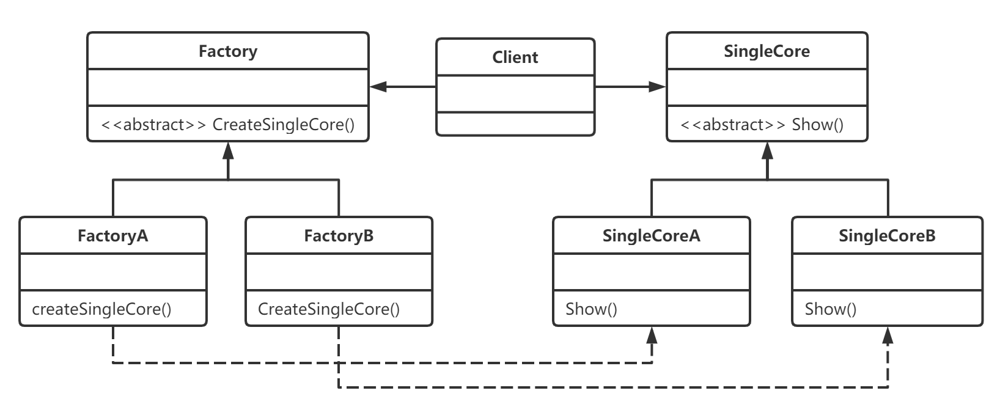
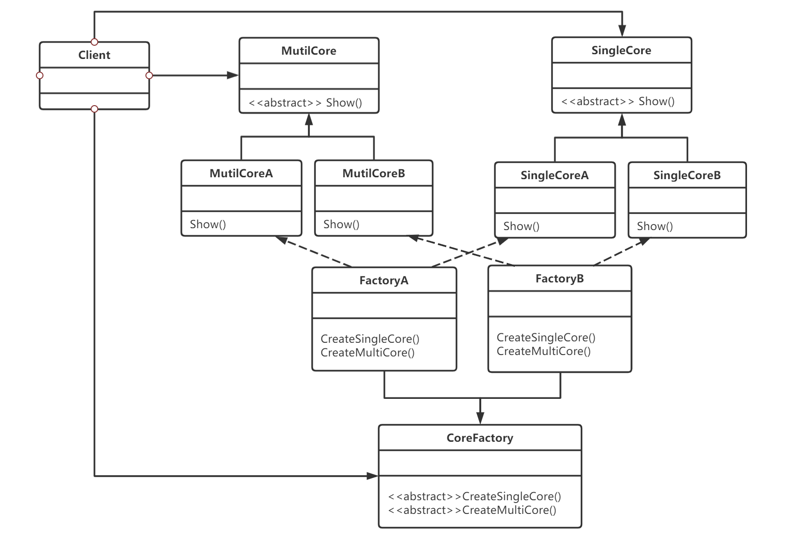
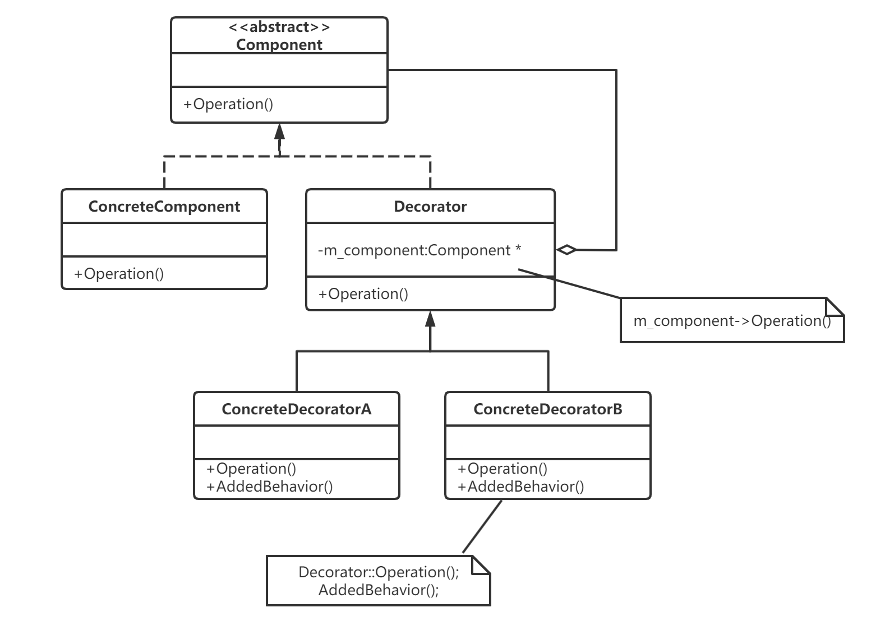
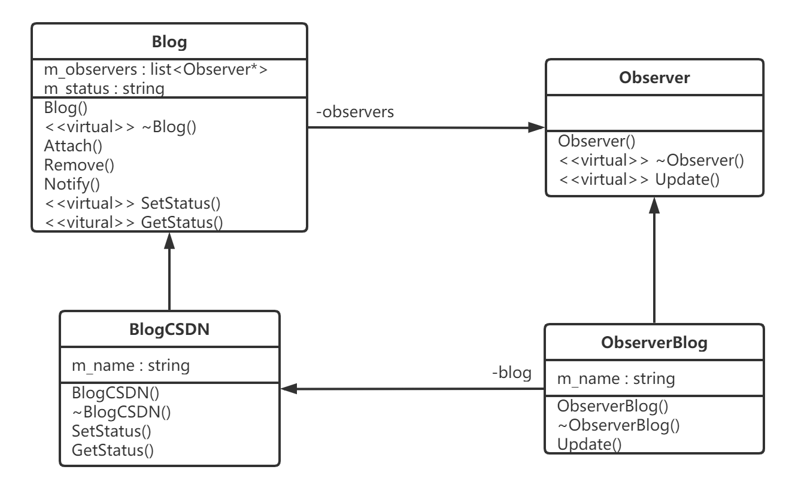

#面试经验学习

## C++多继承使用sizeof()函数值如何计算
在C++中，使用`sizeof()`函数来获取一个类或对象的大小时，其值受到多种因素的影响，特别是在涉及多继承的情况下。下面是一些关键点，它们有助于理解`sizeof()`在多继承中的行为：

1. **基类大小**：每个基类自身的大小都会贡献到派生类的大小中。
2. **内存对齐**：编译器可能会为了优化访问速度而插入填充字节，这也会影响`sizeof()`的结果。
3. **虚函数表指针**：如果类包含虚函数，那么编译器通常会为该类添加一个虚函数表指针（vptr）。这个vptr通常会增加类的大小。
4. **多继承中的重复基类**：在多重继承中，如果两个或更多的基类有共同的基类，那么这个共同的基类数据通常只会被存储一次。但是，这取决于编译器和具体的继承层次结构。

下面是一个简单的例子来说明这些概念：


```cpp
#include <iostream>

class Base1 {
public:
    int a;
};

class Base2 {
public:
    double b;
};

class Derived : public Base1, public Base2 {
public:
    char c;
};

int main() {
    std::cout << "Size of Base1: " << sizeof(Base1) << std::endl;
    std::cout << "Size of Base2: " << sizeof(Base2) << std::endl;
    std::cout << "Size of Derived: " << sizeof(Derived) << std::endl;
    return 0;
}
```
在这个例子中，`Base1`包含一个`int`，`Base2`包含一个`double`，而`Derived`从这两个基类继承，并添加了一个`char`。但是，实际的`sizeof(Derived)`结果可能会受到内存对齐的影响。在某些平台上，`double`可能需要8字节对齐，这可能会导致`Derived`类的大小超过`Base1`、`Base2`和`char`大小的总和。

要准确计算多继承中类的大小，最好的方法是直接在你的编译器和平台上使用`sizeof()`函数，并查看结果。然后，你可以通过分析编译器生成的内存布局来更深入地理解这个结果是如何得到的。这通常可以通过查看编译器生成的汇编代码或使用专门的工具（如`objdump`）来完成。

需要注意的是，由于内存对齐和编译器优化的存在，`sizeof()`的结果在不同的编译器和平台上可能会有所不同。因此，在编写依赖于特定`sizeof()`结果的代码时，应该格外小心。

## 手写一个C++类继承体现封装，继承，多态
下面是一个简单的C++类继承示例，它展示了封装、继承和多态的概念：

```cpp
#include <iostream>
#include <string>

// 基类 Animal，体现了封装
class Animal {
protected:
    std::string name; // 受保护的成员变量，子类可以访问

public:
    Animal(const std::string& name) : name(name) {} // 构造函数，封装了成员变量的初始化

    // 虚函数，体现了多态
    virtual void speak() const {
        std::cout << "The animal speaks." << std::endl;
    }

    // 公共接口，获取动物名称
    std::string getName() const {
        return name;
    }
};

// 派生类 Dog，继承了 Animal
class Dog : public Animal {
public:
    Dog(const std::string& name) : Animal(name) {} // 调用基类的构造函数

    // 重写基类的虚函数 speak
    void speak() const override {
        std::cout << "The dog barks." << std::endl;
    }

    // Dog 类特有的方法
    void wagTail() const {
        std::cout << "The dog wags its tail." << std::endl;
    }
};

// 派生类 Cat，也继承了 Animal
class Cat : public Animal {
public:
    Cat(const std::string& name) : Animal(name) {} // 调用基类的构造函数

    // 重写基类的虚函数 speak
    void speak() const override {
        std::cout << "The cat meows." << std::endl;
    }

    // Cat 类特有的方法
    void purr() const {
        std::cout << "The cat purrs." << std::endl;
    }
};

// 展示多态的函数
void letAnimalSpeak(const Animal& animal) {
    animal.speak(); // 调用的是对象的实际类型（Dog 或 Cat）的 speak 方法
}

int main() {
    Dog myDog("Buddy");
    Cat myCat("Whiskers");

    // 调用 Dog 和 Cat 的特有方法
    myDog.wagTail();
    myCat.purr();

    // 调用 Animal 的公共接口 getName
    std::cout << "Dog's name: " << myDog.getName() << std::endl;
    std::cout << "Cat's name: " << myCat.getName() << std::endl;

    // 展示多态
    letAnimalSpeak(myDog); // 输出 "The dog barks."
    letAnimalSpeak(myCat); // 输出 "The cat meows."

    return 0;
}
```

在这个例子中：

- `Animal` 类是一个基类，它封装了动物的基本属性和行为（`name` 和 `speak` 方法）。`speak` 方法被声明为虚函数，这意味着它可以在派生类中被重写。
- `Dog` 和 `Cat` 类从 `Animal` 类继承，它们各自重写了 `speak` 方法来体现不同的行为，这展示了多态性。
- 每个派生类还添加了它们特有的方法（`wagTail` 和 `purr`），这体现了封装，因为这些方法只对它们各自的实例可见。
- `letAnimalSpeak` 函数接受一个 `Animal` 类型的引用，并调用其 `speak` 方法。由于 `speak` 是虚函数，所以实际调用的将是传入对象的实际类型（`Dog` 或 `Cat`）的 `speak` 实现，这展示了多态性。

通过这个例子，你可以看到C++如何通过封装隐藏对象的内部状态，通过继承创建具有层次结构的类，并通过多态实现运行时行为的变化。

## 如果子类Dog中新增了父类没有的虚函数，通过letAnimalSpeak还能实现多态吗
在C++中，如果子类`Dog`新增了父类`Animal`没有的虚函数，这并不会影响通过基类指针或引用来调用基类中存在的虚函数时的多态行为。`letAnimalSpeak`函数只能调用`Animal`类中定义的虚函数，因为它接受的是`Animal`类型的引用。如果尝试通过`letAnimalSpeak`调用`Dog`特有的虚函数，那么会导致编译错误，因为`Animal`类没有这些函数。
多态性在这里体现在：尽管`letAnimalSpeak`函数接受的是`Animal`类型的引用，但当你传入一个`Dog`对象时，它会调用`Dog`类重写的`speak`方法，而不是`Animal`类的`speak`方法。这展示了C++如何通过虚函数机制实现运行时多态。每个类可以定义自己的虚函数集，而这些函数可以在继承层次结构中的不同级别上被重写或新增。

## C++实现接口类
在C++中，没有像Java或C#那样的显式接口关键字。但是，可以通过纯虚函数（pure virtual functions）来实现接口类。纯虚函数是在基类中声明为`= 0`的虚函数，它没有定义，且派生类必须提供定义。一个类如果包含至少一个纯虚函数，则该类成为抽象类，不能被实例化。这种抽象类在C++中常常被用作接口。

下面是一个简单的C++接口类实现的例子：

```cpp
#include <iostream>
#include <string>

// 接口类
class IAnimal {
public:
    // 纯虚函数
    virtual void speak() const = 0;
    virtual ~IAnimal() {} // 虚析构函数，确保正确释放派生类资源
};

// 派生类 Dog，实现了 IAnimal 接口
class Dog : public IAnimal {
public:
    // 必须实现接口中声明的所有纯虚函数
    void speak() const override {
        std::cout << "The dog barks." << std::endl;
    }
};

// 派生类 Cat，也实现了 IAnimal 接口
class Cat : public IAnimal {
public:
    void speak() const override {
        std::cout << "The cat meows." << std::endl;
    }
};

// 使用接口类的函数
void letAnimalSpeak(const IAnimal& animal) {
    animal.speak(); // 调用的是接口中声明的 speak 方法
}

int main() {
    Dog myDog;
    Cat myCat;

    // 展示多态
    letAnimalSpeak(myDog); // 输出 "The dog barks."
    letAnimalSpeak(myCat); // 输出 "The cat meows."

    return 0;
}
```

在这个例子中，`IAnimal`是一个接口类，它声明了一个纯虚函数`speak`。`Dog`和`Cat`类都从`IAnimal`接口继承，并提供了`speak`函数的实现。

在`letAnimalSpeak`函数中，我们接受一个`IAnimal`类型的引用，这意味着我们可以传递任何实现了`IAnimal`接口的类实例。函数内部调用`speak`方法时，会根据实际对象的类型调用相应的实现，这体现了多态性。

注意，接口类通常只包含纯虚函数，并且通常不含有数据成员。它们的主要作用是定义一组操作的契约，而具体实现则由派生类提供。通过这种方式，接口类使得代码更加灵活和可复用。

## Epoll的底层原理，Epoll、poll、select优缺点
**Epoll的底层原理**

Epoll是Linux内核提供的一种I/O事件通知机制。它通过在用户态和内核态之间建立一个数据结构，使得用户态程序可以在内核态中注册感兴趣的事件。当这些事件发生时，内核会通知用户态程序。Epoll相较于传统的I/O事件通知机制（如select和poll）有以下优势：

1. 支持更多的事件类型：除了传统的文件描述符事件外，还支持网络事件、信号事件等。
2. 支持更大的事件数量：Epoll可以支持的事件数量比传统的I/O事件通知机制更多。

Epoll的实现原理可以概括为以下几个步骤：

1. 创建一个Epoll对象：用户态程序使用Epoll_create函数创建一个Epoll对象，该对象用来管理所有的事件。
2. 等待事件发生：用户态程序使用Epoll_wait函数等待事件发生。当事件发生时，Epoll对象会将该事件通知给用户态程序。

**Epoll、poll、select的关系与不同**

Epoll、poll和select都是I/O复用的基本实现，它们的关系主要体现在它们的发展顺序上：select出现得最早，然后是poll，最后是epoll。它们之间的不同主要体现在以下几个方面：

1. 工作机制：select和poll都需要主动轮询所有的文件描述符以查找就绪的事件，这可能导致在大量文件描述符的情况下性能低下。而epoll采用了基于事件驱动的方式，它只在事件发生时通知用户态程序，从而避免了无用的遍历，提高了效率。
2. 事件数量与类型：select和poll在事件数量和类型上可能有限制，而epoll支持更多的事件类型和更大的事件数量。
3. 数据传输：select和poll在每次调用时都需要从用户空间将文件描述符集合复制到内核空间，这增加了系统调用的开销。而epoll通过一次性的注册和通知机制避免了这种重复的数据传输。

总的来说，Epoll、poll和select在I/O事件通知方面各有特点，选择哪种机制取决于具体的应用场景和需求。在处理大量文件描述符或需要高效的事件通知时，Epoll通常是一个更好的选择。

## 红黑树，AVL树，B+树
红黑树、AVL树和B+树都是树形数据结构，它们用于存储数据并保持数据的排序状态，但它们在实现细节、平衡策略和应用场景上存在一些显著的区别。

1. **红黑树**：
  * **定义与性质**：红黑树是一种自平衡的二叉查找树，每个节点上有一个颜色属性（红色或黑色）。它满足以下性质：每个节点或是红色，或是黑色；根节点是黑色；所有叶子都是黑色（NIL或空节点也视为黑色）；如果一个节点是红色，那么它的两个子节点都是黑色；对于每个节点，从该节点到其所有后代叶子节点的简单路径上，均包含相同数目的黑色节点。
  * **平衡策略**：通过颜色和节点属性的调整，红黑树在插入和删除节点时能够保持相对平衡，确保查找、插入和删除操作的效率。
  * **应用场景**：红黑树在计算机科学中有广泛的应用，特别是在需要动态维护有序数据集合的场景中。

2. **AVL树**：
  * **定义与性质**：AVL树（平衡二叉搜索树）也是一种自平衡的二叉查找树。它要求每个节点的左子树和右子树的高度之差的绝对值不超过1。
  * **平衡策略**：通过旋转操作（单旋转和双旋转）来调整树的结构，以确保在插入或删除节点后，树的高度仍然保持相对平衡。
  * **应用场景**：AVL树对平衡性要求更高，适用于插入和删除操作较少、搜索操作频繁的场景。

3. **B+树**：
  * **定义与性质**：B+树是一种平衡多路查找树，其所有叶子节点具有相同的深度，从而确保从根节点到每个叶子节点的路径长度相同。每个内部节点可以有多个子节点，这些子节点的数量通常由磁盘块的大小决定。所有值都存储在叶子节点中，内部节点仅用于索引，且叶子节点之间通过指针连接成一个链表。
  * **平衡策略**：通过分裂和合并节点，B+树能够保持树的平衡，同时优化磁盘I/O操作。
  * **应用场景**：B+树特别适用于处理大量数据和磁盘存储的情况，具有更好的顺序访问性能和更高的磁盘利用率，因此在数据库和文件系统中应用广泛。

综上所述，红黑树、AVL树和B+树在平衡策略、应用场景和节点结构上存在差异。红黑树和AVL树更侧重于二叉树的平衡，而B+树则是一种多路平衡树，更适合处理大量数据和磁盘存储的情况。在选择使用哪种树结构时，需要根据具体的应用需求来权衡各种因素。

## NIL是什么节点
在红黑树和许多其他类型的树形数据结构中，NIL（或null）节点通常是一个特殊的叶子节点，用于表示树中的空位置或终结点。这些节点不包含任何有效数据，并且通常用于简化树的操作和保持树的平衡。

在红黑树中，NIL节点通常被视为黑色，并用于确保红黑树的性质在树的边界上也成立。例如，红黑树的性质之一是所有叶子节点都是黑色的，这里的叶子节点实际上指的就是NIL节点。

通过引入NIL节点，红黑树能够更简洁地处理边界情况，并使得红黑树的插入、删除和查找等操作更加一致和高效。

需要注意的是，NIL节点并不是实际存储在树中的节点，而是一种逻辑上的概念。在实际实现中，我们通常会使用特殊的值（如null指针）来表示NIL节点。

## int和double的存储原理
`int` 和 `double` 是两种不同的数据类型，它们在计算机内存中的存储原理是不同的。下面，我将分别解释它们的存储原理，以及如何存储负数。

### int 的存储原理

`int` 类型通常用于存储整数。其存储原理主要基于二进制补码形式。在计算机中，整数通常用固定数量的二进制位（bit）来表示，例如 32 位或 64 位。

**无符号整数** 的存储非常直观：每一位都直接表示一个二进制位，从最低有效位（LSB）到最高有效位（MSB）。

**有符号整数** 使用二进制补码形式来表示有符号整数。
二进制补码表示法的关键是将最高位（即最左边的位，也称为符号位）用作正负号指示器。如果符号位为 0，则表示正数；如果符号位为 1，则表示负数。

负数的二进制补码是通过以下步骤得到的：

1. 求出该数的绝对值的二进制表示。
2. 对该二进制表示取反（即 0 变为 1，1 变为 0）。
3. 对取反后的结果加 1。

例如，假设我们有一个 8 位的 `int` 类型，并要存储 `-5`：

1. `5` 的二进制表示是 `00000101`。
2. 取反得到 `11111010`。
3. 加 1 得到 `11111011`。

所以，`-5` 在 8 位 `int` 中的二进制补码表示就是 `11111011`。

### double 的存储原理

`double` 类型用于存储双精度浮点数。存储基于 IEEE 754 标准，该标准定义了浮点数在计算机中的表示方法。

一个 `double` 类型的值通常由三部分组成，需要使用64bit来存储：

1. **符号位（Sign）**：占 1 位，用于表示浮点数的正负。0 表示正数，1 表示负数。
2. **指数部分（Exponent）**：占若干位（对于 `double` 类型通常是 11 位），用于表示浮点数的指数（即幂次）。这部分采用偏移表示法，使得指数可以为正数或负数。
3. **尾数部分（Mantissa）**：也称分数部分，占若干位（对于 `double` 类型通常是 52 位），用于表示浮点数的有效数字。这部分隐含了一个前导的 1（不实际存储），所以实际上可以表示更多的位数。

IEEE 754 标准通过这种方式，可以在有限的位数内表示非常广泛范围内的浮点数，包括非常大或非常小的数，以及非常接近零的数。

## C++对于正数除数和负数被除数的情况定义 cout << -8 % 3 << endl;
在C++中，当计算 `-8 % 3` 时，你正在求 `-8` 除以 `3` 的余数。对于正数除数和负数被除数的情况，C++ 的行为是明确定义的。

取模运算 `%` 的结果总是非负的，并且其值的范围在 `0` 到 `除数-1` 之间（包括 `0`，但不包括 `除数`）。因此，对于 `-8 % 3`，计算过程如下：

1. `-8` 除以 `3` 得到 `-2` 余 `-2`（这里 `-2` 是商，`-2` 是初始的余数，但通常我们不会这样表示，而是说 `-8 = -2 * 3 + (-2)`）。
2. 因为余数应该是非负的，我们需要调整余数以符合这个规则。这通常通过将余数加上除数的倍数来实现，直到余数变为非负。在这种情况下，我们加上 `3`（即除数的1倍），得到 `1`。

所以，`-8 % 3` 的结果是 `1`。

因此，`cout << -8 % 3 << endl;` 会输出 `1`。这个行为是跨平台一致的，因为C++标准明确规定了当被除数为负数时，取模运算的结果应为正数。
## C++对于负数的取模操作没有清晰的定义 cout << 8 % -3 << endl; 
在C++中，表达式 `8 % -3` 试图计算8除以-3的余数。然而，对于负数的取模操作，C++（以及许多其他编程语言）的行为可能并不直观。这主要取决于具体的编译器和平台，因为C++标准并没有明确规定负数的取模行为。

在一些实现中，`8 % -3` 可能返回 `2`，因为在这些实现中，取模操作的行为类似于计算 `8 - (3 * (8 / -3))`，这里 `8 / -3` 向下取整为 `-3`，然后 `8 - (-3 * -3)` 等于 `2`。

但在其他实现中，结果可能不同。例如，一些实现可能会将负除数转换为正数，然后再执行取模操作，这将得到不同的结果。

因此，`cout << 8 % -3 << endl;` 的输出取决于你使用的具体编译器和平台。为了获得一致的结果，最好避免对负数进行取模操作，或者至少确保你了解你使用的编译器或平台如何处理这种情况。

如果你不确定你的编译器或平台如何处理这种情况，最好查阅相关文档或进行测试以确定具体行为。
## C++涉及负数被除数和负数除数的情况没有明确指定 cout << -8 % -3 << endl;
在C++中，计算 `-8 % -3` 涉及负数被除数和负数除数的情况。C++ 标准并没有明确指定这种情况下取模运算符 `%` 的具体行为，因此不同的编译器和平台可能会有不同的实现和结果。

一些编译器可能会将负数的取模运算转换为正数的取模运算，例如，它们可能会先取绝对值，然后再进行取模运算，最后根据被除数和除数的符号来确定结果的符号。按照这种逻辑，`-8 % -3` 可能会先计算 `8 % 3` 得到 `2`，然后由于被除数和除数都是负数，所以结果也是负数，但这里有一个问题：取模运算的结果应该是非负的。因此，这种直接应用符号的方法可能会导致矛盾。

另一种可能的实现方式是，首先执行除法运算（向零取整），然后用被除数减去（除数乘以商），得到余数。例如：

- `-8` 除以 `-3` 向下取整得到 `2`（因为 `-8 / -3` 的结果是 `2` 余 `-2`）。
- 然后计算 `-8 - (-3 * 2)` 得到 `-2`。

但是，由于取模运算的结果应该是非负的，所以最终的结果可能需要对 `-2` 进行调整，例如加上 `-3` 的某个倍数使其变为正数。然而，这里没有明确的规则来确定应该加上多少倍的 `-3`，因为标准没有规定。

因此，`-8 % -3` 的具体结果取决于编译器的实现。一些编译器可能会返回 `-2`，而其他编译器可能会返回 `1`（通过将 `-2` 加上 `-3` 得到），或者它们可能会有完全不同的实现方式。

要获得确定的结果，最好的做法是避免对负数进行取模运算，或者查阅你正在使用的编译器的文档，以了解它如何处理这种情况。如果你需要跨平台一致的行为，可能需要编写自定义的函数来处理负数取模的情况。

## C++ 带符号整数和无符号整数进行运算
一个例子：

```cpp
int a = -8;
unsigned int b = 3;
cout << a / b << endl;
```

变量 `a` 是一个有符号整数（`int`），其值为 `-8`。变量 `b` 是一个无符号整数（`unsigned int`），其值为 `3`。

当执行除法运算 `a / b` 时，由于 C++ 的`整型提升规则`，`a` 会被转换为 `unsigned int` 类型以匹配 `b` 的类型。因此，`-8` 会被转换为一个大的无符号整数。对于大多数现代系统（假设 `int` 和 `unsigned int` 都是 32 位），`-8` 会被转换为 `0xFFFFFFF8`（即一个所有位都为 1，除了最低的 3 位是 0 的数）。

然后，这个大的无符号整数 `0xFFFFFFF8` 会被除以 `3`。由于两个操作数现在都是无符号的，结果也将是一个无符号整数。这个无符号除法的结果将是一个非常大的数，而不是我们期望的有符号整数除法结果 `-2`。

输出将是一个非常大的无符号整数，具体值取决于 `unsigned int` 的大小和系统的表示。

为了避免这种情况并得到期望的有符号结果，你需要将 `b` 转换为 `int`，然后再进行除法运算：

```cpp
int a = -8;
unsigned int b = 3;
cout << a / static_cast<int>(b) << endl;
```

这样，你会得到 `-8` 除以 `3` 的有符号整数结果，即 `-2`。

##C++ 析构函数为什么要加virtual关键字
析构函数加 `virtual` 关键字的主要原因是为了实现多态性，特别是在使用基类指针或引用指向派生类对象时。这种用法通常出现在面向对象的编程中，特别是当基类指针或引用被用来操作派生类对象时。

以下是一些关于为什么析构函数需要 `virtual` 的关键原因：

1. **多态性**：当基类指针或引用指向派生类对象，并调用析构函数时，如果没有将析构函数声明为 `virtual`，则只会调用基类的析构函数，而不会调用派生类的析构函数。这可能导致派生类中的资源（如动态分配的内存）没有被正确释放，从而引发内存泄漏和其他问题。
2. **资源释放**：派生类可能包含一些基类没有的资源，如动态分配的内存、文件句柄等。只有当派生类的析构函数被调用时，这些资源才能得到正确的释放。通过将基类的析构函数声明为 `virtual`，可以确保当基类指针或引用指向派生类对象时，派生类的析构函数也会被调用。
3. **安全性**：不正确地管理资源（如内存）可能导致程序崩溃或安全漏洞。使用 `virtual` 析构函数可以确保资源得到正确的释放，从而提高程序的安全性和稳定性。

需要注意的是，不是所有的析构函数都需要是 `virtual` 的。只有当类被用作基类，并且你希望派生类能够正确地管理自己的资源时，才需要将析构函数声明为 `virtual`。对于不需要多态性的类（即不会被继承的类），将析构函数声明为 `virtual` 是没有必要的，并且可能会增加不必要的开销。

##C++设计模式之 单例类
###饿汉模式，线程安全
懒汉模式的特点是延迟加载，比如配置文件，采用懒汉式的方法，配置文件的实例直到用到的时候才会加载，不到万不得已就不会去实例化类，也就是说在第一次用到类实例的时候才会去实例化
###懒汉模式，线程安全
单例类定义的时候就进行实例化。因为main函数执行之前，全局作用域的类成员静态变量m_Instance已经初始化，故没有多线程的问题。
**注意：c++11及以上使用static局部变量就可以实现singleton了，其初始化和线程安全性质由c++语言规范保证**

```c++
/////////////////// 内部静态变量的懒汉实现（C++11 线程安全）////////////////// 
class Single { 
public: 
    // 获取单实例对象 
    static Single &GetInstance(){ 
        // 局部静态特性的方式实现单实例 
        static Single signal;  // 如果含有数据成员，需要修改构造函数对数据进行初始化
        return signal;
    }
    // 还需要定义一些外部函数 
private: 
    // 禁止外部构造 
    Single(); 
    // 禁止外部析构 
    ~Single(); 
    // 禁止外部复制构造 
    Single(const Single &signal); 
    // 禁止外部赋值操作 
    const Single &operator=(const Single &signal); 
}; 
/////////////////// 内部静态变量的懒汉实现 //////////////////
```
##C++设计模式之 工厂模式
###工厂设计模式的定义

定义一个创建对象的接口，让子类决定实例化哪个类，而对象的创建统一交由工厂去生产，有良好的封装性，既做到了解耦，也保证了最少知识原则。

###工厂设计模式分类

工厂模式属于创建型模式，大致可以分为三类，简单工厂模式、工厂方法模式、抽象工厂模式。听上去差不多，都是工厂模式。下面一个个介绍：
####（1）简单工厂模式


它的主要特点是需要在工厂类中做判断，从而创造相应的产品。当增加新的产品时，就需要修改工厂类。
举例：有一家生产处理器核的厂家，它只有一个工厂，能够生产两种型号的处理器核。客户需要什么样的处理器核，一定要显示地告诉生产工厂。下面给出一种实现方案：

```c++
//程序实例（简单工厂模式）
enum CTYPE {COREA, COREB};     
class SingleCore    
{    
public:    
    virtual void Show() = 0;  
};    
//单核A    
class SingleCoreA: public SingleCore    
{    
public:    
    void Show() { cout<<"SingleCore A"<<endl; }    
};    
//单核B    
class SingleCoreB: public SingleCore    
{    
public:    
    void Show() { cout<<"SingleCore B"<<endl; }    
};    
//唯一的工厂，可以生产两种型号的处理器核，在内部判断    
class Factory    
{    
public:     
    SingleCore* CreateSingleCore(enum CTYPE ctype)    
    {    
        if(ctype == COREA) //工厂内部判断    
            return new SingleCoreA(); //生产核A    
        else if(ctype == COREB)    
            return new SingleCoreB(); //生产核B    
        else    
            return NULL;    
    }    
};    
```
- 优点： 简单工厂模式可以根据需求，动态生成使用者所需类的对象，而使用者不用去知道怎么创建对象，使得各个模块各司其职，降低了系统的耦合性。    
- 缺点：就是要增加新的核类型时，就需要修改工厂类。这就违反了开放封闭原则：软件实体（类、模块、函数）可以扩展，但是不可修改。

####（2）工厂方法模式

所谓工厂方法模式，是指定义一个用于创建对象的接口，让子类决定实例化哪一个类。Factory Method使一个类的实例化延迟到其子类。
举例：这家生产处理器核的产家赚了不少钱，于是决定再开设一个工厂专门用来生产B型号的单核，而原来的工厂专门用来生产A型号的单核。这时，客户要做的是找好工厂，比如要A型号的核，就找A工厂要；否则找B工厂要，不再需要告诉工厂具体要什么型号的处理器核了。下面给出一个实现方案：

```c++
//程序实例（工厂方法模式）
class SingleCore    
{    
public:    
    virtual void Show() = 0;  
};    
//单核A    
class SingleCoreA: public SingleCore    
{    
public:    
    void Show() { cout<<"SingleCore A"<<endl; }    
};    
//单核B    
class SingleCoreB: public SingleCore    
{    
public:    
    void Show() { cout<<"SingleCore B"<<endl; }    
};    
class Factory    
{    
public:    
    virtual SingleCore* CreateSingleCore() = 0;  
};    
//生产A核的工厂    
class FactoryA: public Factory    
{    
public:    
    SingleCoreA* CreateSingleCore() { return new SingleCoreA; }    
};    
//生产B核的工厂    
class FactoryB: public Factory    
{    
public:    
    SingleCoreB* CreateSingleCore() { return new SingleCoreB; }    
};  
```
+ 优点： 扩展性好，符合了开闭原则，新增一种产品时，只需增加改对应的产品类和对应的工厂子类即可。    

+ 缺点：每增加一种产品，就需要增加一个对象的工厂。如果这家公司发展迅速，推出了很多新的处理器核，那么就要开设相应的新工厂。在C++实现中，就是要定义一个个的工厂类。显然，相比简单工厂模式，工厂方法模式需要更多的类定义。

####（3）抽象工厂模式


举例：这家公司的技术不断进步，不仅可以生产单核处理器，也能生产多核处理器。现在简单工厂模式和工厂方法模式都鞭长莫及。抽象工厂模式登场了。它的定义为提供一个创建一系列相关或相互依赖对象的接口，而无需指定它们具体的类。具体这样应用，这家公司还是开设两个工厂，一个专门用来生产A型号的单核多核处理器，而另一个工厂专门用来生产B型号的单核多核处理器，下面给出实现的代码：

```c++
//程序实例（抽象工厂模式）
//单核    
class SingleCore     
{    
public:    
    virtual void Show() = 0;  
};    
class SingleCoreA: public SingleCore      
{    
public:    
    void Show() { cout<<"Single Core A"<<endl; }    
};    
class SingleCoreB :public SingleCore    
{    
public:    
    void Show() { cout<<"Single Core B"<<endl; }    
};    
//多核    
class MultiCore      
{    
public:    
    virtual void Show() = 0;  
};    
class MultiCoreA : public MultiCore      
{    
public:    
    void Show() { cout<<"Multi Core A"<<endl; }    
    
};    
class MultiCoreB : public MultiCore      
{    
public:    
    void Show() { cout<<"Multi Core B"<<endl; }    
};    
//工厂    
class CoreFactory      
{    
public:    
    virtual SingleCore* CreateSingleCore() = 0;  
    virtual MultiCore* CreateMultiCore() = 0;  
};    
//工厂A，专门用来生产A型号的处理器    
class FactoryA :public CoreFactory    
{    
public:    
    SingleCore* CreateSingleCore() { return new SingleCoreA(); }    
    MultiCore* CreateMultiCore() { return new MultiCoreA(); }    
};    
//工厂B，专门用来生产B型号的处理器    
class FactoryB : public CoreFactory    
{    
public:    
    SingleCore* CreateSingleCore() { return new SingleCoreB(); }    
    MultiCore* CreateMultiCore() { return new MultiCoreB(); }    
};  
``` 
- 优点： 工厂抽象类创建了多个类型的产品，当有需求时，可以创建相关产品子类和子工厂类来获取。
- 缺点： 扩展新种类产品时困难。抽象工厂模式需要我们在工厂抽象类中提前确定了可能需要的产品种类，以满足不同型号的多种产品的需求。但是如果我们需要的产品种类并没有在工厂抽象类中提前确定，那我们就需要去修改工厂抽象类了，而一旦修改了工厂抽象类，那么所有的工厂子类也需要修改，这样显然扩展不方便。

###C++设计模式之 装饰器模式


装饰器计模式的定义:指在不改变现有对象结构的情况下，动态地给该对象增加一些职责（即增加其额外功能）的模式，它属于对象结构型模式。
- 优点
（1）装饰器是继承的有力补充，比继承灵活，在不改变原有对象的情况下，动态的给一个对象扩展功能，即插即用；
（2）通过使用不用装饰类及这些装饰类的排列组合，可以实现不同效果；
（3）装饰器模式完全遵守开闭原则。

- 缺点
装饰模式会增加许多子类，过度使用会增加程序得复杂性。

- 装饰模式的结构与实现
通常情况下，扩展一个类的功能会使用继承方式来实现。但继承具有静态特征，耦合度高，并且随着扩展功能的增多，子类会很膨胀。如果使用组合关系来创建一个包装对象（即装饰对象）来包裹真实对象，并在保持真实对象的类结构不变的前提下，为其提供额外的功能，这就是装饰模式的目标。下面来分析其基本结构和实现方法。

- 装饰模式主要包含以下角色：
（1）抽象构件（Component）角色：定义一个抽象接口以规范准备接收附加责任的对象。
（2）具体构件（ConcreteComponent）角色：实现抽象构件，通过装饰角色为其添加一些职责。
（3）抽象装饰（Decorator）角色：继承抽象构件，并包含具体构件的实例，可以通过其子类扩展具体构件的功能。
（4）具体装饰（ConcreteDecorator）角色：实现抽象装饰的相关方法，并给具体构件对象添加附加的责任。

装饰模式的实现代码如下：
```c++
#include <string>
#include <iostream>
 
//基础组件接口定义了可以被装饰器修改的操作
class Component {
 public:
  virtual ~Component() {}
  virtual std::string Operation() const = 0;
};
 
//具体组件提供了操作的默认实现。这些类在程序中可能会有几个变体
class ConcreteComponent : public Component {
 public:
  std::string Operation() const override {
    return "ConcreteComponent";
  }
};
 
//装饰器基类和其他组件遵循相同的接口。这个类的主要目的是为所有的具体装饰器定义封装接口。
//封装的默认实现代码中可能会包含一个保存被封装组件的成员变量，并且负责对齐进行初始化
class Decorator : public Component {
 
 protected:
  Component* component_;
 
 public:
  Decorator(Component* component) : component_(component) {
  }
  
  //装饰器会将所有的工作分派给被封装的组件
  std::string Operation() const override {
    return this->component_->Operation();
  }
};
 
//具体装饰器必须在被封装对象上调用方法，不过也可以自行在结果中添加一些内容。
class ConcreteDecoratorA : public Decorator {
 
 //装饰器可以调用父类的是实现，来替代直接调用组件方法。
 public:
  ConcreteDecoratorA(Component* component) : Decorator(component) {
  }
  std::string Operation() const override {
    return "ConcreteDecoratorA(" + Decorator::Operation() + ")";
  }
};
 
//装饰器可以在调用封装的组件对象的方法前后执行自己的方法
class ConcreteDecoratorB : public Decorator {
 public:
  ConcreteDecoratorB(Component* component) : Decorator(component) {
  }
 
  std::string Operation() const override {
    return "ConcreteDecoratorB(" + Decorator::Operation() + ")";
  }
};
 
//客户端代码可以使用组件接口来操作所有的具体对象。这种方式可以使客户端和具体的实现类脱耦
void ClientCode(Component* component) {
  // ...
  std::cout << "RESULT: " << component->Operation();
  // ...
}
 
int main() {
  
  Component* simple = new ConcreteComponent;
  std::cout << "Client: I've got a simple component:\n";
  ClientCode(simple);
  std::cout << "\n\n";
  
  Component* decorator1 = new ConcreteDecoratorA(simple);
  Component* decorator2 = new ConcreteDecoratorB(decorator1);
  std::cout << "Client: Now I've got a decorated component:\n";
  ClientCode(decorator2);
  std::cout << "\n";
 
  delete simple;
  delete decorator1;
  delete decorator2;
 
  return 0;
}
```

###C++设计模式之观察者模式

 
观察者设计模式的定义：指多个对象间存在一对多的依赖关系，当一个对象的状态发生改变时，所有依赖于它的对象都得到通知并被自动更新。这种模式有时又称作发布-订阅模式、模型-视图模式，它是对象行为型模式。

- 优点
（1）降低了目标与观察者之间的耦合关系，两者之间是抽象耦合关系。符合依赖倒置原则。
（2）目标与观察者之间建立了一套触发机制。
- 缺点
（1）目标与观察者之间的依赖关系并没有完全解除，而且有可能出现循环引用。
（2）当观察者对象很多时，通知的发布会花费很多时间，影响程序的效率。

- 观察者模式的主要角色如下：
（1）抽象主题（Subject）角色：也叫抽象目标类，它提供了一个用于保存观察者对象的聚集类和增加、删除观察者对象的方法，以及通知所有观察者的抽象方法。
（2）具体主题（Concrete Subject）角色：也叫具体目标类，它实现抽象目标中的通知方法，当具体主题的内部状态发生改变时，通知所有注册过的观察者对象。
（3）抽象观察者（Observer）角色：它是一个抽象类或接口，它包含了一个更新自己的抽象方法，当接到具体主题的更改通知时被调用。
（4）具体观察者（Concrete Observer）角色：实现抽象观察者中定义的抽象方法，以便在得到目标的更改通知时更新自身的状态。

- 博客订阅的例
当博主发表新文章的时候，即博主状态发生了改变，那些订阅的读者就会收到通知，然后进行相应的动作，比如去看文章，或者收藏起来。博主与读者之间存在种一对多的依赖关系。下面给出相应的UML图设计:

可以看到博客类中有一个观察者链表（即订阅者），当博客的状态发生变化时，通过Notify成员函数通知所有的观察者，告诉他们博客的状态更新了。而观察者通过Update成员函数获取博客的状态信息。代码实现不难，下面给出C++的一种实现。

```c++
//观察者
class Observer  
{
public:
    Observer() {}
    virtual ~Observer() {}
    virtual void Update() {} 
};
//博客
class Blog  
{
public:
    Blog() {}
    virtual ~Blog() {}
    void Attach(Observer *observer) { m_observers.push_back(observer); }     //添加观察者
    void Remove(Observer *observer) { m_observers.remove(observer); }        //移除观察者
    void Notify() //通知观察者
    {
        list<Observer*>::iterator iter = m_observers.begin();
        for(; iter != m_observers.end(); iter++)
            (*iter)->Update();
    }
    virtual void SetStatus(string s) { m_status = s; } //设置状态
    virtual string GetStatus() { return m_status; }    //获得状态
private:
    list<Observer* > m_observers; //观察者链表
protected:
    string m_status; //状态
};

//以上是观察者和博客的基类，定义了通用接口。
//博客类主要完成观察者的添加、移除、通知操作，设置和获得状态仅仅是一个默认实现。
//下面给出它们相应的子类实现。

//具体博客类
class BlogCSDN : public Blog
{
private:
    string m_name; //博主名称
public:
    BlogCSDN(string name): m_name(name) {}
    ~BlogCSDN() {}
    void SetStatus(string s) { m_status = "CSDN通知 : " + m_name + s; } //具体设置状态信息
    string GetStatus() { return m_status; }
};
//具体观察者
class ObserverBlog : public Observer   
{
private:
    string m_name;  //观察者名称
    Blog *m_blog;   //观察的博客，当然以链表形式更好，就可以观察多个博客
public: 
    ObserverBlog(string name,Blog *blog): m_name(name), m_blog(blog) {}
    ~ObserverBlog() {}
    void Update()  //获得更新状态
    { 
        string status = m_blog->GetStatus();
        cout<<m_name<<"-------"<<status<<endl;
    }
};
//测试案例
int main()
{
    Blog *blog = new BlogCSDN("wuzhekai1985");
    Observer *observer1 = new ObserverBlog("tutupig", blog);
    blog->Attach(observer1);
    blog->SetStatus("发表设计模式C++实现（15）——观察者模式");
    blog->Notify();
    delete blog; delete observer1;
    return 0;
}

```